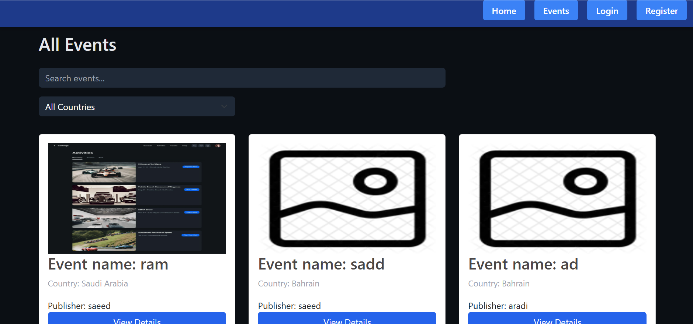

🎯 EventMap — Frontend

EventMap is a modern event discovery platform where users can explore events, view details, like and comment, and create accounts to publish their own events.

This repository contains the frontend built with React and React Bootstrap, consuming a REST API backend.

🚀 Features
👤 Guest Users

View all events

View event details

See likes and comments

View event publisher username

Register a new account

Login to an existing account

🔐 Authenticated Users

Create events

Upload event images (with default placeholder)

Like & unlike events

Add, edit, and delete comments

Edit or delete own events

View publisher profiles (ready for extension)

🛡 Admin Users

Edit or delete any event

Edit or delete any comment

🖼 Image Handling

Events can include an image

If no image is provided, a default placeholder PNG is shown automatically

Fallback image is used if an image URL fails to load

🧑‍💻 Tech Stack

React

React Router

React Bootstrap

Axios

Context API

Custom Hooks

useLikes

useComments

🔐 Authentication Flow

User registers with email, username, and password

OTP verification is required

JWT token is stored in localStorage

Protected routes require authentication

❤️ Likes & 💬 Comments

Likes are toggled per user

Comment system supports:

Add

Edit (owner/admin)

Delete (owner/admin)

Comments display the comment author username

🔗 Backend

This frontend expects a REST API backend with:

Authentication

Events

Likes

Comments

User profiles

➡️ Backend repo: (add link here)

🧪 Future Improvements

Public user profile page

Event filtering by country

Pagination for events

Image optimization

👨‍💻 Author

Saeed Sadeq